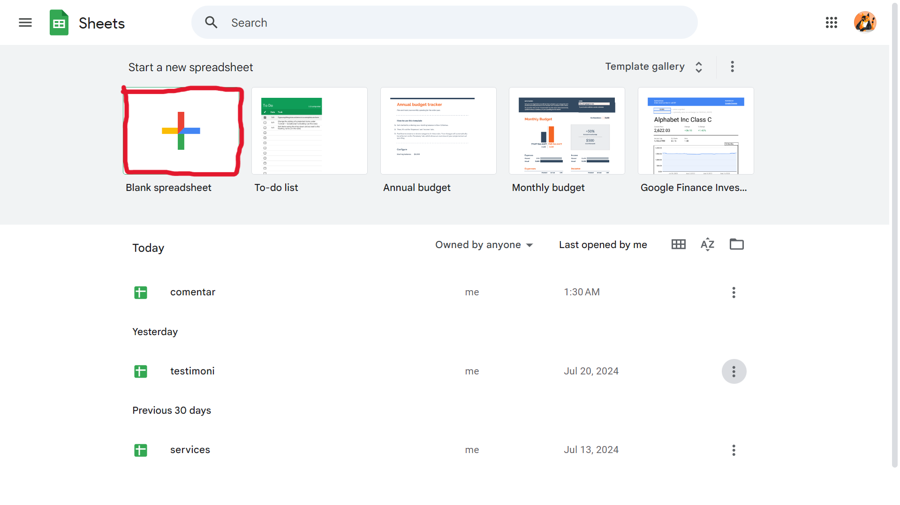

# Wedding Invitation Website

## Demo

[](https://sandiperdiansah.github.io/wedding-invitation)

## Features

- **Data Storage**: Uses Google Sheets API for storing and managing invitation data.
- **Responsive Design**: Optimized for various screen sizes.

## Tech Stack


<hr/>

## How to Use

1. **Download the project or clone the repository**:
    ```bash
    git clone https://github.com/sandiperdiansah/wedding-invitation.git
    ```

2. **Note**: You have two options to use this source code:
    - **Without Modification**: Open the
      file [data.js](https://github.com/SandiPerdiansah/wedding-invitation/blob/main/src/assets/data/data.js) to use the
      code as is.
    - **With Customization**: Adjust the appearance and content according to your needs.

### How to Edit `data.js`

- **Details**: Update the names of the bride and groom, the wedding date and time, and the venue address.
- **Links**:
    - **Calendar**: Provide the URL for a Google Calendar event. Create an event, add the title and description, then
      save it. Click "Share" to get the shareable link.

  
  
  

    - **Map**: Include the URL to the location on Google Maps.
- **Gallery**: You may include more than 5 images; just ensure they are optimized for web use.
- **Audio**: Replace default audio files and optimize their sizes.

### Setting Up Google Sheets API

1. **Create a Google Sheets file**: Open Google Sheets, create a new file, and name it accordingly.



2. **Adjust the Table in Your Sheets**:
   

3. **Add Google Apps Script**:
    - Open the Google Sheets file, go to Extensions > Apps Script, and add the following code:

    ```javascript
    const SHEET_NAME = 'comentar';

    const doGet = () => {
      try {
        const sheet = SpreadsheetApp.getActiveSpreadsheet().getSheetByName(SHEET_NAME);
        const [, ...data] = sheet.getDataRange().getValues();

        const comentar = data.map(([id, name, status, message, date, color]) => ({
          id,
          name,
          status,
          message,
          date,
          color
        }));

        const response = {
          status: 200,
          message: 'Success get services',
          comentar
        };

        return ContentService
          .createTextOutput(JSON.stringify(response))
          .setMimeType(ContentService.MimeType.JSON);
      } catch (error) {
        const errorMessage = {
          status: 500,
          message: `Error retrieving data: ${error}`
        };

        return ContentService
          .createTextOutput(JSON.stringify(errorMessage))
          .setMimeType(ContentService.MimeType.JSON);
      }
    };

    const doPost = (e) => {
      try {
        const { id, name, status, message, date, color } = JSON.parse(e.postData.contents);
        const sheet = SpreadsheetApp.getActiveSpreadsheet().getSheetByName(SHEET_NAME);

        if (!sheet) {
          throw new Error(`Sheet "${SHEET_NAME}" not found`);
        }

        sheet.appendRow([id, name, status, message, date, color]);

        const response = {
          status: 200,
          message: 'Success add service'
        };

        return ContentService
          .createTextOutput(JSON.stringify(response))
          .setMimeType(ContentService.MimeType.JSON);
      } catch (error) {
        const errorMessage = {
          status: 500,
          message: `Error adding data: ${error}`
        };

        return ContentService
          .createTextOutput(JSON.stringify(errorMessage))
          .setMimeType(ContentService.MimeType.JSON);
      }
    };
    ```

4. **Deploy the Script**:
    - Click "Deploy" and select "New deployment".
    - Choose "Web app" in the deployment settings.


Copy the provided URL. If you encounter errors, redeploy as cross-origin issues may occur on the first attempt.

5. **Navbar Customization**: If you want to change the icons, adjust them as needed. Using the provided icons can
   simplify the process.

---

Thank you for visiting the repository. I hope your wedding day is smooth and filled with joy! 😊
